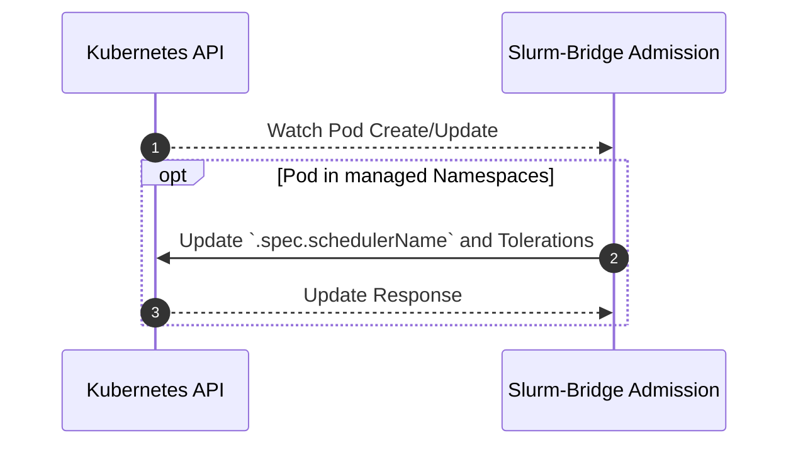

# Admission

## Table of Contents

<!-- mdformat-toc start --slug=github --no-anchors --maxlevel=6 --minlevel=1 -->

- [Admission](#admission)
  - [Table of Contents](#table-of-contents)
  - [Overview](#overview)
  - [Design](#design)
    - [Sequence Diagram](#sequence-diagram)

<!-- mdformat-toc end -->

## Overview

[The Kubernetes documentation](https://kubernetes.io/docs/reference/access-authn-authz/admission-controllers/)
defines admission controllers as:

> a piece of code that intercepts requests to the Kubernetes API server prior to
> persistence of the resource, but after the request is authenticated and
> authorized.

It also states that:

> Admission control mechanisms may be validating, mutating, or both. Mutating
> controllers may modify the data for the resource being modified; validating
> controllers may not.

The `slurm-bridge` admission controller is both mutating and validating. It
modifies pods within namespaces specified in `helm/slurm-bridge/values.yaml` to
use the `slurm-bridge` [scheduler] instead of the default Kubernetes scheduler,
and rejects unsupported scheduling and resource configurations.

## Design

Any pods created in the specified namespaces will have their
`.spec.schedulerName` changed to the slurm-bridge [scheduler].

Managed namespaces are defined as a list of namespaces as configured in the
admission controller's `values.yaml` for `managedNamespaces[]`. Alternatively, a
`managedNamespaceSelector` can be used to select namespaces based on labels. If
`managedNamespaceSelector` is set, `managedNamespaces` will be ignored.

Managed pods can request either native `cpu` or the CPU DRA extended resource
`deviceclass.resource.kubernetes.io/dra.cpu`, but cannot specify both. CPU DRA
must be requested explicitly; native `cpu` requests are not converted to DRA
requests by the admission controller.

In-place resizing is not supported for managed pods. The admission controller
rejects requests to the `pods/resize` subresource so Kubernetes resources cannot
diverge from the corresponding Slurm allocation.

Pod topology spread constraints are not supported. The admission controller
rejects managed pods with a non-empty `spec.topologySpreadConstraints` field
rather than allowing the scheduler to ignore the requested placement behavior.

The `slurmjob.slinky.slurm.net/constraints` annotation is combined with the
`slurm_bridge_gres_compatible` node feature that every bridge job requires. The
admission controller rejects the few constraint expressions that Slurm's grammar
does not allow to be combined with an additional feature, such as a bare feature
count (`rack1*2`) or an OR outside parentheses mixed with parentheses or
brackets (`(a&b)|(c&d)`), so the job fails at creation rather than on every
scheduling cycle. See [supported Slurm job annotations] for the supported forms.

Managed pods are also validated against the supported DRA DeviceClass set.
Unsupported DeviceClass resources in requests or limits are rejected for init
containers and regular containers. Operators can extend the supported set with
configured device profiles. See [Device resources] for the built-in classes,
profile configuration, and legacy device-plugin resources. Pods outside managed
namespaces that do not select the `slurm-bridge` scheduler are not subject to
this validation.

### Sequence Diagram

<!-- Links -->

[device resources]: workload.md#device-resources
[scheduler]: scheduler.md
[supported slurm job annotations]: workload.md#supported-slurm-job-annotations
