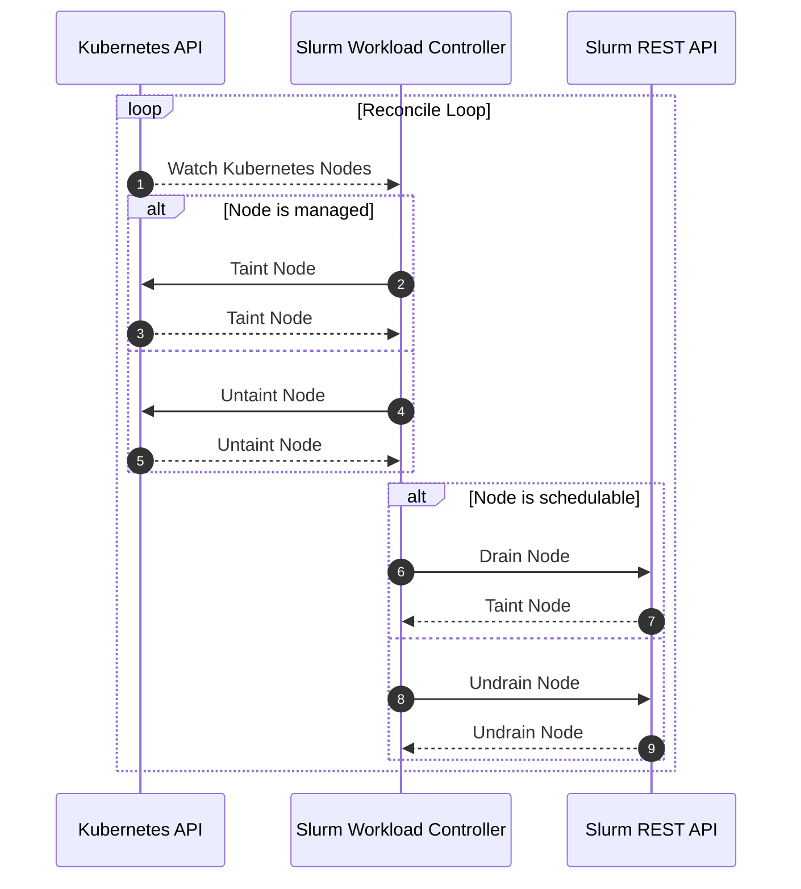
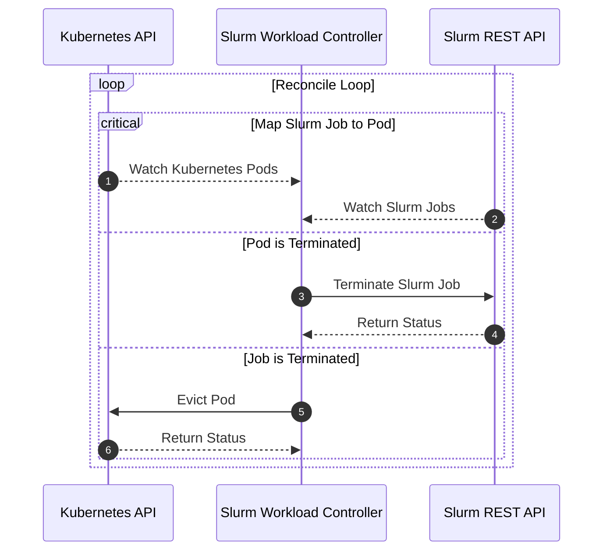

# Controllers

## Table of Contents

<!-- mdformat-toc start --slug=github --no-anchors --maxlevel=6 --minlevel=1 -->

- [Controllers](#controllers)
  - [Table of Contents](#table-of-contents)
  - [Overview](#overview)
  - [Node Controller](#node-controller)
    - [Node Registration and Partition Assignment](#node-registration-and-partition-assignment)
  - [Workload Controller](#workload-controller)

<!-- mdformat-toc end -->

## Overview

[The Kubernetes documentation](https://kubernetes.io/docs/concepts/architecture/controller/)
defines controllers as:

> control loops that watch the state of your cluster, then make or request
> changes where needed. Each controller tries to move the current cluster state
> closer to the desired state.

Within `slurm-bridge`, there are multiple controllers that manage the state of
different bridge components:

- **Node Controller** - Responsible for tainting the Kubernetes nodes that are
  managed by `slurm-bridge`
- **Workload Controller** - Responsible for synchronizing Slurm and Kubernetes
  workloads on the nodes that are managed by `slurm-bridge`

## Node Controller

The node controller is responsible for tainting the managed nodes so the
scheduler component is fully in control of all workload that is bound to those
nodes.

Additionally, this controller will reconcile certain node states for scheduling
purposes. Slurm becomes the source of truth for scheduling among managed nodes.

A managed node is defined as a node that has a colocated `kubelet` and `slurmd`
on the same physical host, and the slurm-bridge can schedule on.

### Node Registration and Partition Assignment

The node controller supports dynamic node registration in Slurm through
Kubernetes node labels:

- **Node Registration Label**
  (`scheduler.slinky.slurm.net/slurm-bridge-external-node`): When this label is
  present on a Kubernetes node, the node controller will automatically register
  the node in Slurm with the correct CPU and memory resources. When the label is
  removed, the node will be removed from Slurm.

- **Node Partitions Annotation**
  (`scheduler.slinky.slurm.net/external-node-partitions`): Specifies the Slurm
  partition(s) the node should be assigned to. The value is a comma-separated
  list of partition names. When this annotation is set, the node controller
  will:

  1. Validate that all specified partitions exist in Slurm
  1. Register the node with node features matching the partition names
  1. Allow Slurm's NodeSet configuration in `slurm.conf` to assign the node to
     those partitions

  **Example:**

  ```yaml
  apiVersion: v1
  kind: Node
  metadata:
    name: worker-1
    labels:
      scheduler.slinky.slurm.net/external-node: "true"
    annotations:
      scheduler.slinky.slurm.net/external-node-partitions: "slurm-bridge,gpu"
  ```

  This will register the node with features `slurm-bridge,gpu`, allowing it to
  be assigned to those partitions in `slurm.conf` using NodeSet features.

  **Note:** The controller will error if any specified partition does not exist
  in Slurm. Partitions must be pre-configured in Slurm's configuration.



## Workload Controller

The workload controller reconciles Kubernetes Pods and Slurm Jobs. Slurm is the
source of truth for what workload is allowed to run on which managed nodes.


