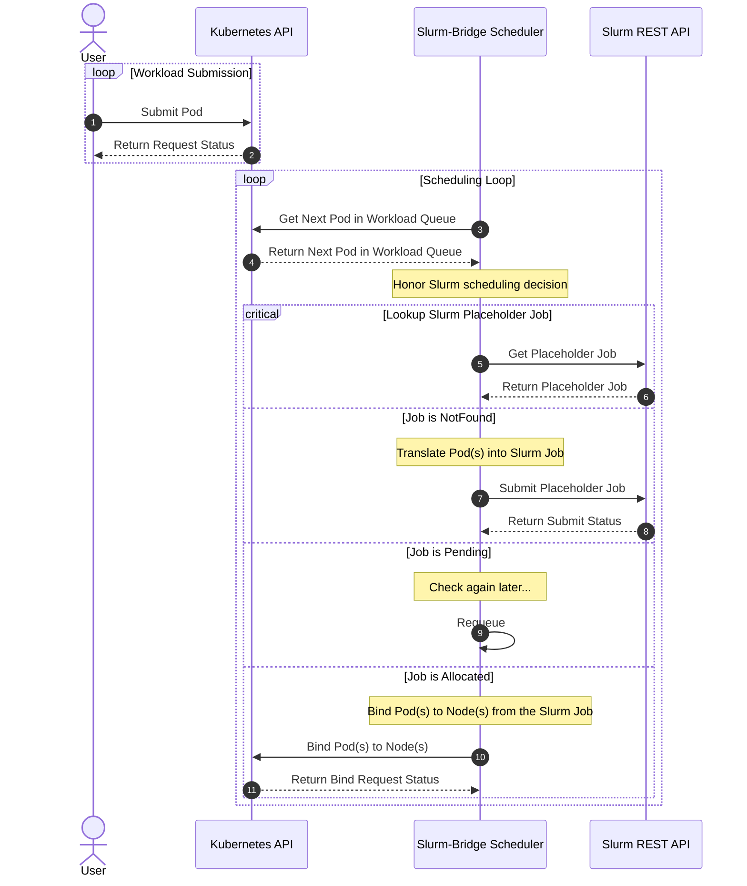

# Scheduler

## Table of Contents

<!-- mdformat-toc start --slug=github --no-anchors --maxlevel=6 --minlevel=1 -->

- [Scheduler](#scheduler)
  - [Table of Contents](#table-of-contents)
  - [Overview](#overview)
  - [Design](#design)
    - [Sequence Diagram](#sequence-diagram)
    - [Placeholder Jobs](#placeholder-jobs)
      - [Annotations](#annotations)

<!-- mdformat-toc end -->

## Overview

In Kubernetes, scheduling refers to making sure that pods are matched to nodes
so that the kubelet can run them.

The scheduler controller in `slurm-bridge` is responsible for [scheduling]
eligible pods onto nodes that are managed by `slurm-bridge`. In doing so, the
`slurm-bridge` scheduler interacts with the Slurm REST API in order to acquire
allocations for its' workloads. In `slurm-bridge`, `slurmctld` serves as the
source of truth for scheduling decisions.

## Design

This scheduler is designed to be a non-primary scheduler (e.g. should not
replace the default [kube-scheduler]). This means that only certain pods should
be scheduled via this scheduler (e.g. non-critical pods).

This scheduler represents Kubernetes Pods as a Slurm Job, waits for Slurm to
schedule the Job, then informs Kubernetes on which nodes to allocate the
represented Pods. This scheduler defers scheduling decisions to Slurm, hence
certain assumptions about the environment must be met for this to function
correctly.

### Sequence Diagram



### Placeholder Jobs

Slurm-bridge uses Slurm to schedule both Slurm and Kubernetes workloads on the
same resources. To do this, slurm-bridge must represent Kubernetes workloads as
a Slurm job that is submitted for the purpose of scheduling. This job is
referred to as a "placeholder job", as it is only used for scheduling: once a
placeholder job is allocated resources, the actual execution of the workload is
handled by the Kubelet.

#### Annotations

Slurm-bridge accepts the following workload types: Jobs, JobSets, Pods,
PodGroups, and LeaderWorkerSets. Annotations can be set on the workload object
to change the parameters that are used to submit a placeholder job to Slurm. The
following table lists some of the available annotations. For a complete list,
see the [annotations.go] source.

| Annotation                             | Description                       | Example      |
| -------------------------------------- | --------------------------------- | ------------ |
| slurmjob.slinky.slurm.net/gres         | Overrides the default gres.       | "GPU:V100:2" |
| slurmjob.slinky.slurm.net/job-name     | Sets the job name.                | "research"   |
| slurmjob.slinky.slurm.net/max-nodes    | Sets the maximum number of nodes. | "3"          |
| slurmjob.slinky.slurm.net/mem-per-node | Sets the amount of memory.        | "8Gi"        |
| slurmjob.slinky.slurm.net/partition    | Overrides the default partition.  | "debug"      |

An example of the annotations in use:

```yaml
---
apiVersion: batch/v1
kind: Job
metadata:
  name: job-sleep-single
  namespace: slurm-bridge
  annotations:
    slurmjob.slinky.slurm.net/job-name: job-sleep-single
    slurmjob.slinky.slurm.net/account: schedmd
    slurmjob.slinky.slurm.net/partition: debug
spec:
  completions: 1
  parallelism: 1
  template:
    spec:
      schedulerName: slurm-bridge-scheduler
      containers:
        - name: sleep
          image: busybox:stable
          command: [sh, -c, sleep 3]
          resources:
            requests:
              cpu: '1'
              memory: 100Mi
            limits:
              cpu: '1'
              memory: 100Mi
      restartPolicy: Never
```

<!-- Links -->

[annotations.go]: https://github.com/SlinkyProject/slurm-bridge/blob/main/internal/wellknown/annotations.go
[kube-scheduler]: https://kubernetes.io/docs/concepts/architecture/#kube-scheduler
[scheduling]: https://kubernetes.io/docs/concepts/scheduling-eviction/kube-scheduler/#scheduling
